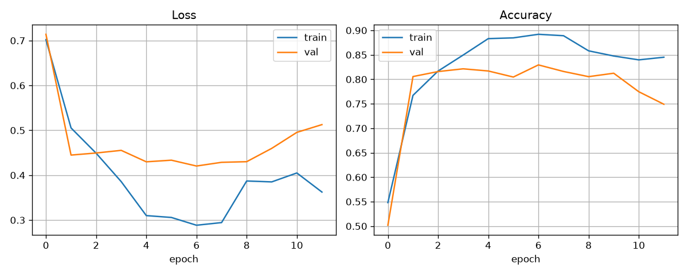

# RNN Review Analysis


Sentiment analysis of IMDB movie reviews with a **SimpleRNN** neural network.
Type a review into the Streamlit app and get an instant
positive / negative prediction with a confidence score.

The recurrent core is **SimpleRNN only** — no LSTM, GRU, bidirectional layers,
Transformers, or attention are used anywhere in this project.

## Overview

Sentiment analysis decides whether a piece of text expresses a positive or a
negative opinion. This project trains a recurrent neural network on labeled
IMDB movie reviews: an embedding layer turns words into vectors and a
**SimpleRNN** reads them in order, keeping a running memory of what it has
seen, before a small classifier outputs the final sentiment. A Streamlit
frontend wraps the trained model so anyone can analyze a review without
writing code.

## Key Features

- Free-text review input (Streamlit text area) with empty-input handling
- Text preprocessing identical to training (lowercasing, punctuation removal)
- Tokenization through the IMDB word index with out-of-vocabulary handling
- Fixed-length sequence generation (padded / truncated to 300 tokens)
- SimpleRNN-based sentiment prediction with confidence score
- Long-review notice (tells you when truncation kicked in)
- Reproducible training script with early stopping and LR scheduling
- Test-set evaluation script (accuracy, precision, recall, F1, confusion matrix)
- Single-review CLI inference script

## Model Architecture

Final model: `simple_rnn_imdb_optimized.h5` — **1,321,217 parameters**.

```text
Input (300 token IDs)
 ↓
Embedding (vocabulary 10,000 → 128-dim vectors)
 ↓
SimpleRNN (128 units, tanh, dropout 0.2)
 ↓
Dropout (0.3)
 ↓
Dense (64 units, relu)
 ↓
Dropout (0.3)
 ↓
Dense (1 unit, sigmoid) → P(class = positive)
```

## Dataset

- **Source:** IMDB movie-review dataset via `tensorflow.keras.datasets.imdb`
  (`num_words=10000`)
- **Size:** 25,000 training + 25,000 test reviews
- **Classes:** `0` = negative, `1` = positive (balanced 50/50)
- **Split used here:** 20,000 train / 5,000 validation / 25,000 test
- Mean review length ≈ 239 words (train) / ≈ 231 words (test)

## Preprocessing

```text
Raw review
 ↓
Lowercase + punctuation removal
 ↓
Word → ID (known word: index + 3, unknown word: 2 = OOV)
 ↓
Pre-pad / pre-truncate to 300 tokens
 ↓
SimpleRNN → sigmoid score → sentiment label
```

The app reuses exactly this pipeline (`clean_text`, `encode_review`,
`preprocess_text` in `streamlit_app.py`). No separate tokenizer or scaler file
is needed — the IMDB word index ships with the Keras dataset.

## Model Training

- Optimizer: Adam, learning rate `1e-3`, `clipnorm=1.0`
- Loss: `binary_crossentropy`
- Batch size 64, up to 15 epochs (best checkpoint: epoch 7)
- Early stopping (`patience=5`, `restore_best_weights=True`)
- `ReduceLROnPlateau(factor=0.5, patience=2)`
- Regularization: dropout (0.2 inside the RNN, 0.3 / 0.3 around the dense layer)
- Hardware: Intel Core i5-13450HX CPU, 24 GB RAM
  (TensorFlow 2.15 on native Windows is CPU-only, so the RTX 3050 6 GB laptop
  GPU was not usable for training; ~15 s/epoch, ~3 min total)
- Command: `python final_train.py`

## Performance

Measured on the 25,000-review IMDB test set:

| Metric | Before (baseline) | After (optimized) |
|---|---:|---:|
| Test loss | 0.4636 | **0.4175** |
| Accuracy | 0.7989 | **0.8282** |
| Precision | 0.8098 | **0.8224** |
| Recall | 0.7813 | **0.8373** |
| F1 score | 0.7953 | **0.8298** |
| Validation accuracy | 0.8112 | **0.8294** |

The baseline (`Embedding → SimpleRNN(128, relu) → Dense(1)`, maxlen 500, no
regularization) was unstable — its first-epoch loss exploded to ≈ 2.3e11 —
which motivated the switch to `tanh` with gradient clipping, a shorter 300-token
window, dropout, and learning-rate scheduling.



## Project Structure

```text
RNN-review-analysis/
├── streamlit_app.py              # Streamlit frontend (run this)
├── final_train.py                # Optimized SimpleRNN training script
├── evaluate.py                   # Test-set evaluation
├── predict.py                    # Single-review CLI inference
├── simple_rnn_imdb_optimized.h5  # Final SimpleRNN model (maxlen 300)
├── loss_curves_optimized.png     # Training/validation curves
├── history_optimized.json        # Full training history (loss, acc, lr)
├── requirements.txt              # Dependencies
├── README.md                     # This file
└── .gitignore
```

## Installation

```bash
git clone https://github.com/bharat-02/RNN-review-analysis.git
cd RNN-review-analysis
python -m venv venv
venv\Scripts\Activate.ps1
pip install -r requirements.txt
```

## How to Run

**Streamlit app:**

```bash
streamlit run streamlit_app.py
```

**Retrain the model:**

```bash
python final_train.py
```

**Evaluate on the test set:**

```bash
python evaluate.py
```

**Classify one review from the terminal:**

```bash
python predict.py "This movie was fantastic! The acting was great."
```

## Example Usage

In the app, entering:

> This movie was fantastic! Great acting.

returns **Positive** (score ≈ 0.68), while:

> Terrible boring waste of time.

returns **Negative** (score ≈ 0.02). Scores between 0.35 and 0.65 are reported
as *Uncertain (near decision boundary)* since the underlying model is a binary
classifier. Empty input is rejected with a warning, and reviews longer than 300
words are truncated exactly as in training (the app tells you when this happens).

## Testing

Run the automated suite (fresh process, no retraining involved):

```bash
python tests/test_model.py
```

It verifies model loading (SimpleRNN-only architecture, correct input/output
shapes, finite weights), preprocessing parity with training, end-to-end
predictions on 7 review types (positive, negative, ambiguous, short,
punctuation/case, unknown words, 400-word truncation), edge cases (empty,
whitespace-only, single character, 2000-word input, digits/punctuation), and a
no-retrain guard on the Streamlit app. Latest result: **7/7 tests passed**.

The Streamlit app was also launched headless and verified (health check `ok`,
main page HTTP 200, positive/negative sample predictions correct).

## Technologies Used

- Python 3.11
- TensorFlow / Keras 2.15 (SimpleRNN model)
- NumPy
- scikit-learn (metrics)
- Streamlit 1.60 (web app)
- Matplotlib (training plots)

## Future Improvements

- Tune SimpleRNN width/depth and sequence length around the current setup
- Add batch prediction for multiple reviews
- Add probability calibration and richer confidence visualization
- Improve text normalization (e.g. contraction handling)
- Add automated tests and CI

## Author

[bharat-02](https://github.com/bharat-02)
